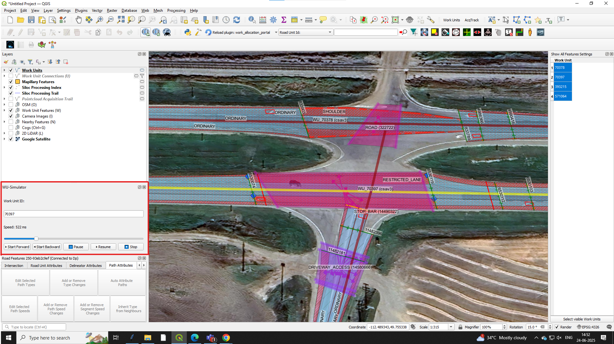

# WU-Simulator

A dockable QGIS plugin that animates a selected line feature (Work Unit) with forward/backward playback, speed control, and pause/resume features.

## Features

- Animate along a selected line by `work_unit_id`
- Forward and backward simulation
- Speed slider control (in milliseconds)
- Pause, Resume, Stop controls
- Fully dockable GUI inside QGIS

## Installation

1. Download the ZIP from this repository
2. In QGIS: `Plugins → Manage and Install Plugins → Install from ZIP`
3. Select the downloaded plugin folder

## Usage

1. Open the plugin from `Plugins → WU-Simulator`
2. Enter a valid `work_unit_id` from your `Work Units` layer
3. Click **Start Forward** or **Start Backward** to simulate animation

## Screenshot

## Author

**Dheepika .P**  
🖂 dheepikanz01@gmail.com
